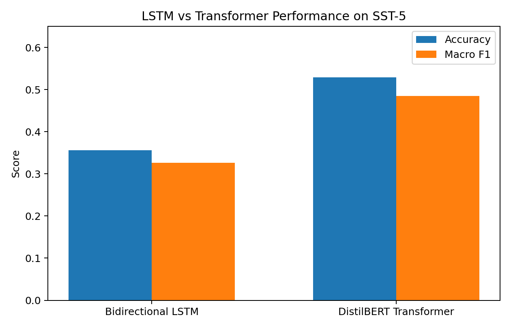

# Deep Learning for Fine-Grained Sentiment Analysis

This project compares recurrent neural networks and transformer-based language models for fine-grained sentiment classification.

The task uses the SST-5 dataset, where each sentence is classified into one of five sentiment categories:

- Very negative
- Negative
- Neutral
- Positive
- Very positive

The project evaluates two model families:

1. Bidirectional LSTM
2. DistilBERT Transformer

---

## Research Question

How do traditional sequence models and pretrained Transformer models differ in their ability to classify fine-grained sentiment in text?

---

## Repository Structure

```text
.
├── data/
│   └── README.md
│
├── figures/
│   └── model_comparison.png
│
├── notebooks/
│   ├── 01_data_preprocessing.ipynb
│   ├── 02_lstm_model.ipynb
│   ├── 03_transformer_model.ipynb
│   ├── 04_model_comparison.ipynb
│   └── README.md
│
├── results/
│   ├── lstm_results.csv
│   ├── transformer_results.csv
│   ├── model_comparison.csv
│   └── README.md
│
└── README.md
```

---

## Model Performance

| Model | Accuracy | Macro F1 |
|---|---:|---:|
| Bidirectional LSTM | 0.356 | 0.326 |
| DistilBERT Transformer | 0.529 | 0.485 |

<p align="center">
  
</p>

---

## Key Finding

The Transformer-based model outperformed the LSTM model on fine-grained sentiment classification. This result suggests that pretrained contextual representations are especially useful for distinguishing subtle sentiment categories in text.

---

## Tools

- Python
- PyTorch
- Hugging Face Transformers
- Pandas
- Scikit-learn
- Matplotlib

---

## Author

Yunxuan (Ariel) Hu  
M.S. Business Analytics  
University of Arizona
